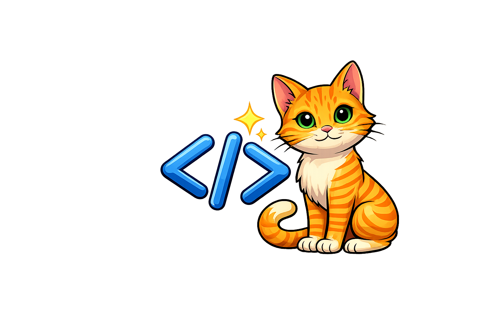
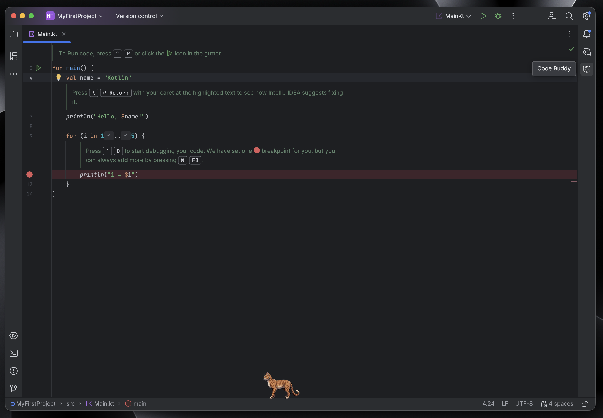
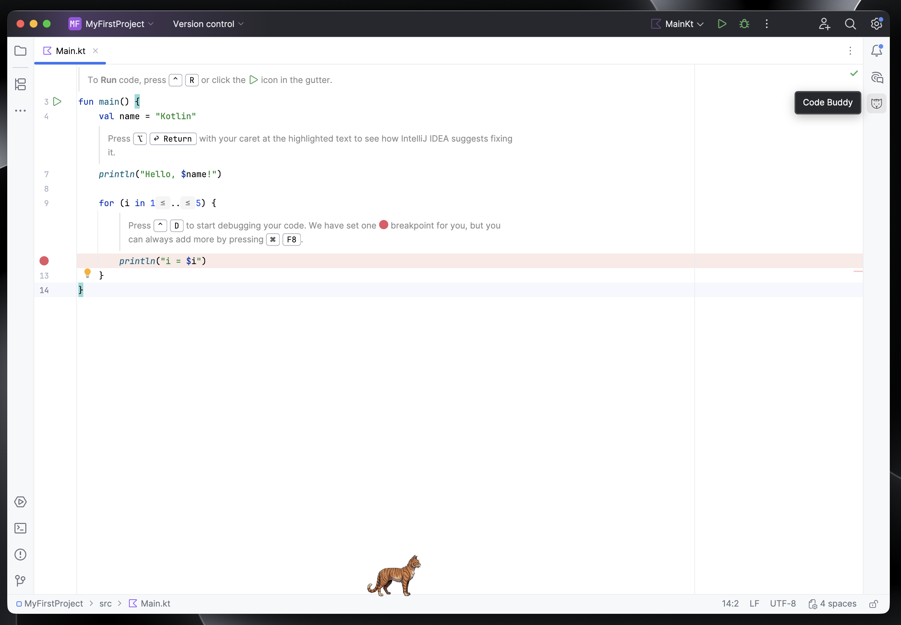
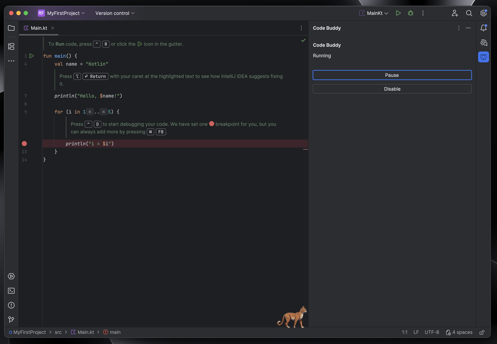
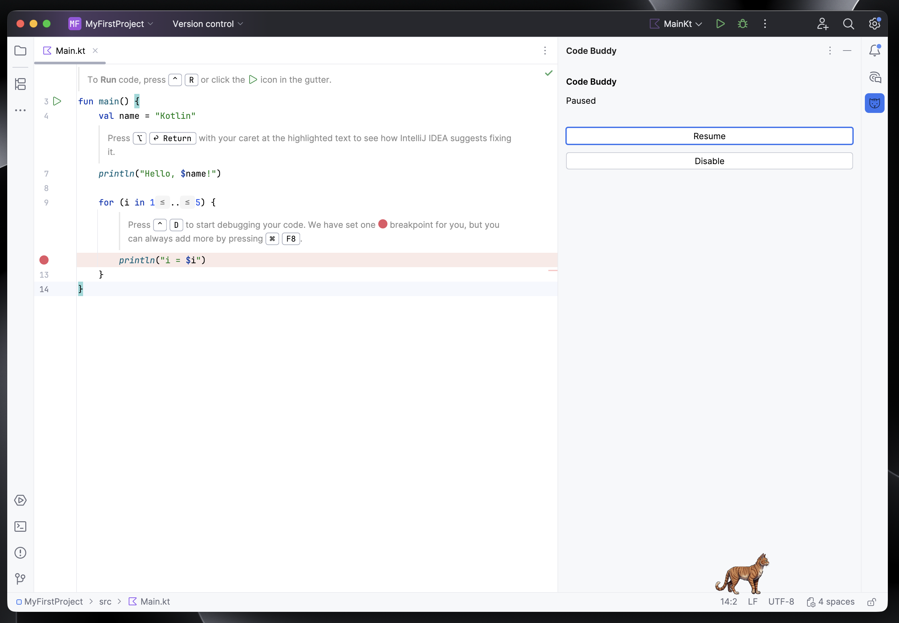

  

---

<h1 align="center">Code Buddy</h1>

[//]: # (![Build]&#40;https://github.com/L00kAhead/code-buddy/workflows/Build/badge.svg&#41;)

[//]: # ([![Version]&#40;https://img.shields.io/jetbrains/plugin/v/MARKETPLACE_ID.svg&#41;]&#40;https://plugins.jetbrains.com/plugin/MARKETPLACE_ID&#41;)

[//]: # ([![Downloads]&#40;https://img.shields.io/jetbrains/plugin/d/MARKETPLACE_ID.svg&#41;]&#40;https://plugins.jetbrains.com/plugin/MARKETPLACE_ID&#41;)

Code Buddy adds a small animated cat companion to JetBrains IDEs.
The cat walks along the bottom of the editor and can be paused or disabled at any time.
The plugin is lightweight and runs quietly in the background.

---

## Features

- Animated cat companion rendered as an overlay inside the IDE
- Smooth walking animation
- Automatically appears when a project is opened
- Tool window controls to pause or resume the animation
- Option to completely enable or disable the cat overlay
- Designed to be subtle and distraction free

---
## Screenshots
The screenshots below show Code Buddy running in light and dark themes, along with the tool window controls.

[Watch the demo video](assets/video/pluginDemoVideo.mp4)

---

<!-- Plugin description -->
Code Buddy adds a small animated cat companion to your JetBrains IDE.

The cat walks along the bottom of the editor window and can be paused, resumed, or hidden entirely using the Code Buddy tool window. The plugin is designed to be lightweight and distraction free, adding a small amount of personality to the IDE without interfering with normal development.

Code Buddy works across all JetBrains IDEs and starts automatically when a project is opened.
<!-- Plugin description end -->

---

## Installation

- `Using the IDE built-in plugin system`:
  - <kbd>Settings/Preferences</kbd> > <kbd>Plugins</kbd> > <kbd>Marketplace</kbd> > <kbd>Search for "Code Buddy"</kbd> >
  <kbd>Install</kbd>

- `Using JetBrains Marketplace`:
    - Go to [JetBrains Marketplace](https://plugins.jetbrains.com/plugin/MARKETPLACE_ID) and install it by clicking the <kbd>Install to ...</kbd> button in case your IDE is running.
    - You can also download the [latest release](https://plugins.jetbrains.com/plugin/MARKETPLACE_ID/versions) from JetBrains Marketplace and install it manually using
      <kbd>Settings/Preferences</kbd> > <kbd>Plugins</kbd> > <kbd>⚙️</kbd> > <kbd>Install plugin from disk...</kbd>

- `Manually`:

  - Download the [latest release](https://github.com/L00kAhead/code-buddy/releases/latest) and install it manually using
  <kbd>Settings/Preferences</kbd> > <kbd>Plugins</kbd> > <kbd>⚙️</kbd> > <kbd>Install plugin from disk...</kbd>

---

## Changelog
See [CHANGELOG.md](CHANGELOG.md) for a detailed list of changes.

---
## Credits
Cat animation sprites by [**FrolicForge**](https://frolicforge.itch.io)

---

## License

Copyright © 2026 Himanshu Soni

This project is licensed under the Apache License, Version 2.0.

---

Plugin based on the [IntelliJ Platform Plugin Template][template].

[template]: https://github.com/JetBrains/intellij-platform-plugin-template
[docs:plugin-description]: https://plugins.jetbrains.com/docs/intellij/plugin-user-experience.html#plugin-description-and-presentation
